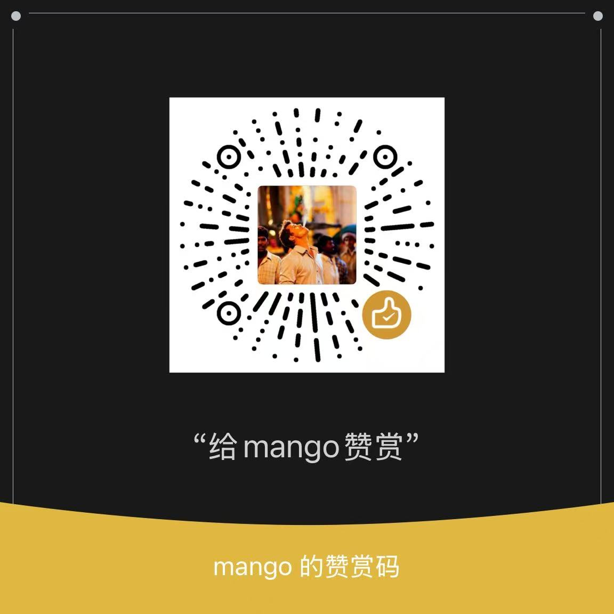

# TestBrain

> 基于大语言模型的智能测试平台，聚焦手工&接口测试用例生成、评审与知识复用、java源码分析，帮助测试团队打造高效、可扩展的“AI 测试助手”。

## 🧭 项目概览

TestBrain 通过 Django + LangChain + 多模型接入的方式，提供以下核心能力：

- **多 Agent 协同**：针对不同测试场景提供专用智能体（测试用例生成、评审、PRD 分析、接口用例生成、Java 代码分析等）。
- **多 LLM 供应商**：支持 DeepSeek、Qwen 等模型，并可按 Agent 维度配置默认模型/参数，前端也可手动切换。
- **知识库加持**：集成 Milvus 向量数据库与 BGEM3 Embedding，支持文档解析、入库、向量检索与上下文增强。
- **可扩展架构**：模块化的 LLM 工厂、Agent 封装、知识库服务，便于新增模型、Agent 或自定义流程。

## 🛠️ 功能模块

| 模块 | 功能 | 关键实现 |
| --- | --- | --- |
| **AI Agents** | - `test_case_generator`：根据需求生成用例（支持同步/异步调用 LLM）<br>- `test_case_reviewer`：对生成的用例进行评审与打分<br>- `prd_analyzer`：解析 PRD，提炼测试点/场景（内置 JSON 修复兜底）<br>- `iface_case_generator`：基于接口描述生成测试用例<br>- `java_code_analyzer`：分析 Java 代码并梳理潜在测试点 | `apps/ai_agents/*`，配合统一的 Prompt 管理与服务调用 |
| **LLM 集成** | - `LLMServiceFactory` 动态创建模型客户端<br>- `get_agent_llm_configs()` 返回 Agent 默认模型与 Provider 列表<br>- 支持同步 `invoke` 与异步 `ainvoke` | `apps/llm/base.py` / `apps/llm/utils.py` |
| **知识库** | - `KnowledgeConfig.ready()` 预热 Milvus + BGEM3 单例<br>- `KnowledgeService` 封装向量入库、检索、相似度匹配<br>- 支持多格式文档解析、批量嵌入与检索 | `apps/knowledge/*` |
| **核心应用** | - Web 页面与 API（Django View）<br>- 用例管理（`TestCase` 模型）<br>- 配置管理、日志、权限预留 | `apps/core/*` |

## 🏗️ 技术栈 & 服务依赖

- **运行框架**：Python 3.12、Django 5.1.6、LangChain
- **向量数据库**：Milvus 2.4.x（需先启动 Milvus 服务）
- **Embedding 模型**：`BAAI/bge-m3`（通过 `sentence-transformers`，首启由 `KnowledgeConfig` 预热）
- **数据库**：MySQL 8.x（默认使用 `mysqlclient`）
- **其他依赖**：Celery、Redis（如需异步任务，可在后续扩展）


## 📁 项目结构

```
TestBrain/
├── apps/
│   ├── ai_agents/            # 各类智能体实现
│   │   ├── test_case_generator/
│   │   ├── test_case_reviewer/
│   │   ├── prd_analyzer/
│   │   ├── iface_case_generator/
│   │   └── java_code_analyzer/
│   ├── core/                 # 公共视图、模型、页面
│   ├── knowledge/            # Milvus & Embedding 服务
│   └── llm/                  # LLM 工厂、Provider 定义
├── config/                   # Django 配置（INSTALLED_APPS、数据库、LLM 设置等）
├── templates/                # 页面模板
├── static/                   # 静态资源
├── videos/                   # 功能演示视频
├── requirements.txt          # 依赖列表
└── manage.py
```

## ⚙️ 配置说明

### 1. 环境变量（`.env` 模板）

```dotenv
# LLM Keys
DEEPSEEK_API_KEY=your_key
QWEN_API_KEY=your_key

# 数据库
MYSQL_HOST=127.0.0.1
MYSQL_PORT=3306
MYSQL_USER=root
MYSQL_PASSWORD=123456
MYSQL_DB=testbrain

# 向量数据库
MILVUS_HOST=127.0.0.1
MILVUS_PORT=19530
MILVUS_COLLECTION=vv_knowledge_collection
```

### 2. LLM Provider 配置

`config/settings.py` 中维护：

```python
LLM_PROVIDERS = {
    "default_provider": "deepseek",
    "deepseek": {...},
    "qwen": {...}
}

AGENT_LLM_DEFAULTS = {
    "test_case_generator": {"provider": "deepseek"},
    "prd_analyzer": {"provider": "deepseek"},
    ...
}
```

- 前端使用 `providers` 渲染下拉列表，可手动切换模型。
- 后端通过 `get_agent_llm_configs(agent_name)` 获取默认 Provider 及配置。

### 3. 知识库单例初始化

`apps/knowledge/apps.py` 中的 `KnowledgeConfig.ready()`：

```python
class KnowledgeConfig(AppConfig):
    name = "apps.knowledge"

    def ready(self):
        from .embedding import BGEM3Embedder
        from .vector_store import MilvusVectorStore

        if not hasattr(self, "embedder"):
            self.embedder = BGEM3Embedder()
        if not hasattr(self, "vector_store"):
            self.vector_store = MilvusVectorStore()
```

业务侧通过 `KnowledgeService()` 自动复用该单例。

## 🚀 本地运行

1. **准备依赖**
   ```bash
   python -m venv .venv
   source .venv/bin/activate   # Windows 使用 .venv\Scripts\activate
   pip install -r requirements.txt
   ```

2. **配置环境变量**
   - 复制 `.env` 示例并补全数据库、Milvus、LLM Key。

3. **初始化数据库**
   ```bash
   python manage.py migrate
   ```

4. **启动服务**
   ```bash
   python manage.py runserver 0.0.0.0:8000
   ```

5. **启动java源码分析服务**
   仓库地址:https://github.com/MangoFisher/java-analyzer.git
   ```bash
   mvn spring-boot:run -Dspring-boot.run.profiles=dev
   ```

6. **访问页面**
   - Web 控制台：http://127.0.0.1:8000/


## 🧠 Agent 详情

| Agent | 入口页面 | 描述 |
| --- | --- | --- |
| 测试用例生成 | `/test_case_generator/` | 根据需求文本生成结构化测试用例列表，支持自定义设计方法、测试类型、生成条数，并可保存到数据库。
| 测试用例评审 | `/test_case_reviewer/` | 对既有用例进行评审，输出风险 & 改进建议。
| PRD 分析 | `/prd_analyzer/` | 解析 PRD Markdown，产出测试点与测试场景；内置 JSON 修复逻辑以提升容错。
| 接口用例生成 | `/iface_case_generator/` | 根据接口定义生成测试思路，支持模型切换。
| Java 代码分析 | `/java_code_analyzer/` | 静态分析 Java 源码，输出潜在缺陷与测试关注点。

## 📚 知识库最佳实践

为了让 LLM 生成的测试用例更加贴合业务，建议：

1. 上传与需求相关的文档：PRD、设计文档、API 文档、过往测试用例、UI 设计稿等。
2. 确保文件命名规范、内容清晰，便于向量检索与上下文匹配。
3. 使用知识库检索功能，确认相关内容已写入 Milvus 并能搜索到。

## 🧪 常见问题（FAQ）

**Q1. 为什么日志里多次出现 “正在加载 BGE-M3 模型…”？**  
默认 `runserver` 会启动监视进程 + 工作进程，两次初始化属正常现象。上线部署（Gunicorn/Uvicorn）或使用 `--noreload` 可验证单例。

**Q2. LLM 输出的 JSON 仍解析失败怎么办？**  
系统已内置 `_basic_json_fix()` 处理未转义换行、中文引号、缺逗号等常见问题。如仍失败，建议检查 Prompt 或手动修正模型输出。

**Q3. 如何新增模型供应商？**  
在 `LLM_PROVIDERS` 中新增配置，并在 `LLMServiceFactory` 里实现创建逻辑。随后可在 `AGENT_LLM_DEFAULTS` 或前端下拉中引用。

**Q4. 是否支持异步调用？**  
`TestCaseGeneratorAgent` 已支持 `async_generate`，可在异步视图或任务中直接 `await` 调用，LangChain 内部使用 `ainvoke`。

## 📼 演示视频

- 测试用例生成：`videos/测试用例生成.mp4`
- 测试用例评审：`videos/测试用例评审.mp4`
- 知识库文档上传：`videos/知识库文档上传.mp4`

## ☕️ 支持作者

创作不易，欢迎扫码鼓励：



---

若在使用中遇到问题或有新需求，欢迎提 Issue 或 PR，一起打造更强大的智能测试平台！
